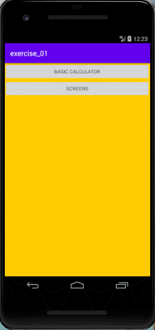

# Exercise 01

Creating a basic native android application.

## Requirements

1. Main screen
   - This screen must contain two buttons that redirects to basic calculator and screens.
2. Basic Calculator screen
   - This screen must contain the basic mathematicaloperation (addition, subtraction, multiplication, and division)
3. Screens screen
   - This screen must contain three buttons with colors and each button should redirect to an screen with the same color.

## Demo
